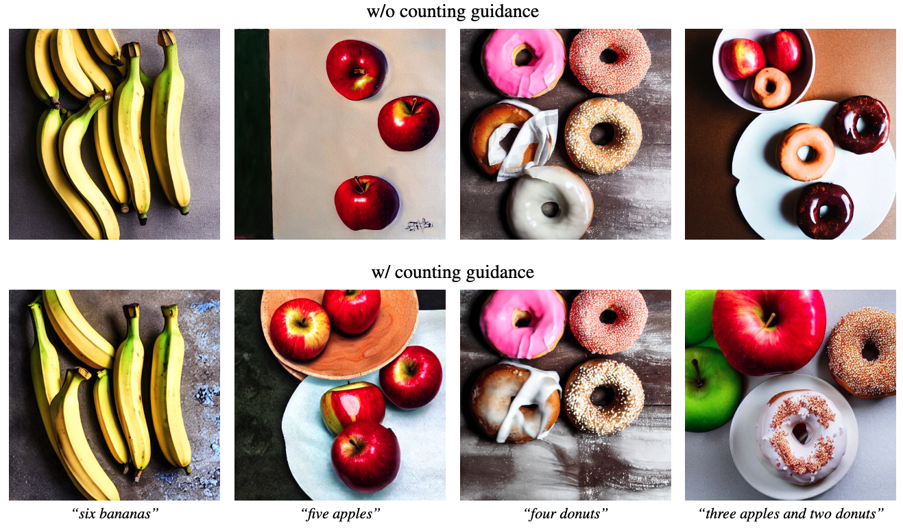

<h1 align="center"> <p>[WACV 2025 Oral] Counting Guidance for High Fidelity Text-to-Image Synthesis</p></h1>
<h4 align="center">
    <p>
      <a href="https://wonjunn.github.io/" target="_blank">Wonjun Kang</a><sup>1,2*</sup>, <a href="https://scholar.google.com/citations?user=G1EpeWYAAAAJ&hl=en" target="_blank">Kevin Galim</a><sup>2*</sup>, <a href="http://cvml.ajou.ac.kr/wiki/index.php/Professor" target="_blank">Hyung Il Koo</a><sup>2,3</sup>, <a href="https://ece.snu.ac.kr/en/research-faculty/faculty/fulltime?md=view&profid=p041" target="_blank">Nam Ik Cho</a><sup>1</sup>
  </p>
  <p>
    <sup>1</sup><a href="https://en.snu.ac.kr/index.html" target="_blank">Seoul National University</a>, <sup>2</sup><a href="https://furiosa.ai/" target="_blank">FuriosaAI</a>, <sup>3</sup><a href="https://www.ajou.ac.kr/en/index.do" target="_blank">Ajou University</a>
   </p>
    </h4>

<p align="center">
    <a href="https://arxiv.org/abs/2306.17567">
        
    </a>
</p>


**Paper Link**: https://arxiv.org/abs/2306.17567



## Updates

* [01/20/25] Our paper is selected for oral presentation at <a href="https://wacv2025.thecvf.com/">WACV 2025</a>! 🎉🎉
* [10/28/24] Our paper is accepted by <a href="https://wacv2025.thecvf.com/">WACV 2025</a>! 🎉

## Usage

- Note, we tested the code on a NVIDIA V100 32GB GPU. On different GPUs, results might slightly differ.

### Setup

- Download RCC counting network weights [counting.ckpt](https://drive.google.com/drive/folders/1WdMk98Ujw-QWbYwRNLzQ0jxiqi4Hpt8-) to weights/counting.ckpt
- Run
    ```
    conda env create --name ldm_count --file=env.yml
    pip install timm==0.9.2
    conda activate ldm_count
    wget https://huggingface.co/ShilongLiu/GroundingDINO/resolve/main/groundingdino_swint_ogc.pth -P weights
    ```

### Generate one image with counting guidance
```
python generate.py \
    --prompt "six apples on the table" \
    --counting_words apples \
    --counting_word_counts 6 \
    --counting_scale 1.0 \
    --seed 0 \
    --output output.png
```


### Reproduce paper results
```
# Check exp/ for outputs
sh run_metrics.sh
```

## Citation
```tex
@article{kang2023counting,
  title={Counting guidance for high fidelity text-to-image synthesis},
  author={Kang, Wonjun and Galim, Kevin and Koo, Hyung Il},
  journal={arXiv preprint arXiv:2306.17567},
  year={2023}
}
```
